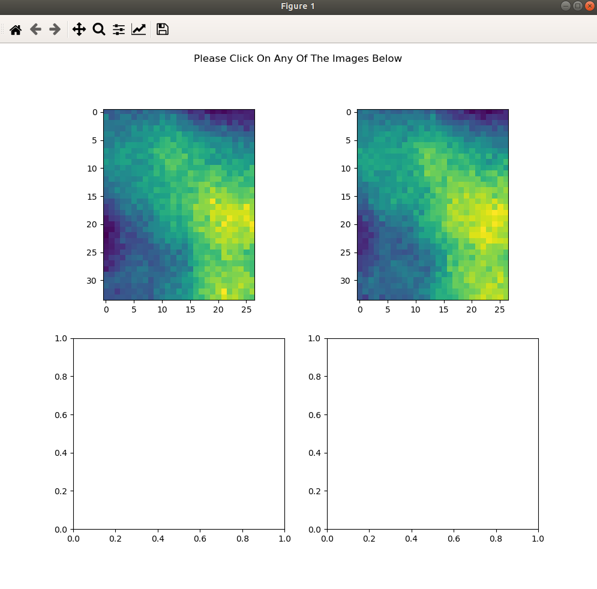
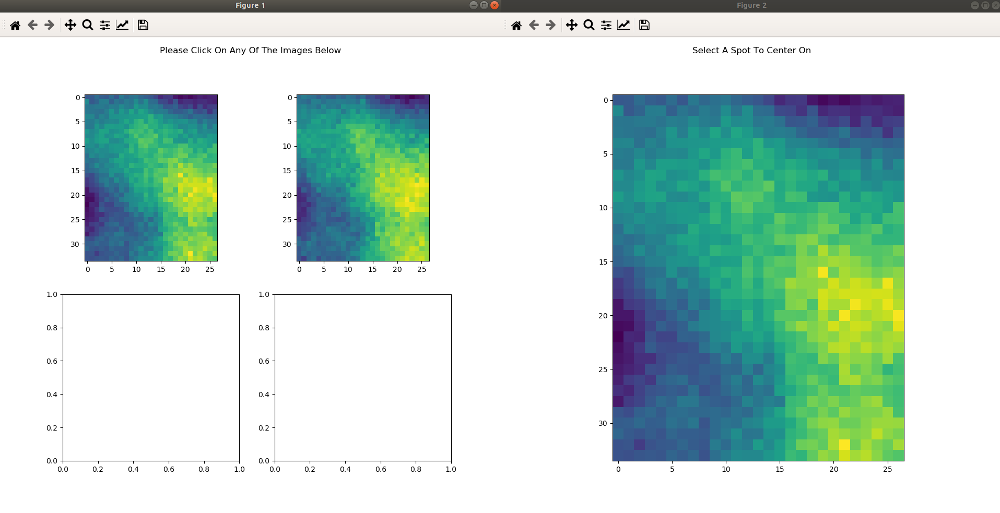
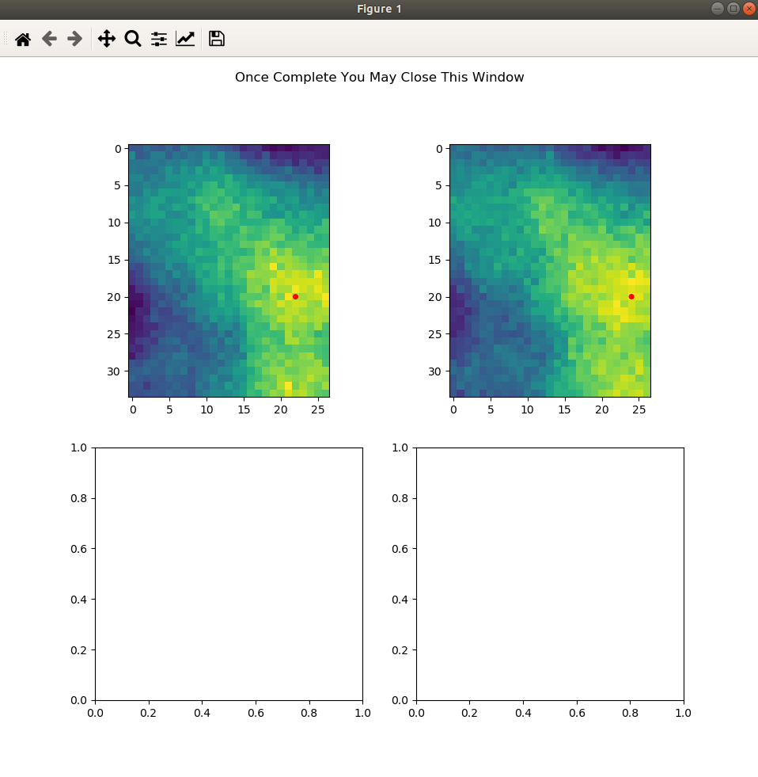
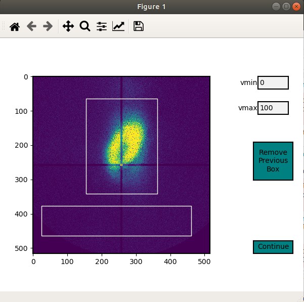

******************
Analyzing the Data
******************

Setting Up Detector Channels
============================

After importing the data, the User will likely want to store detector
channel values for the Experimental Run. This avoids having to remember
them every time the User would like to go back and analyze a specific
dataset. To begin, run the following

.. code:: python
    
    %load_ext autoreload
    %autoreload 2
    %matplotlib qt

    from sxdm import *

    file='/path/to/file.h5'
    
    # Display a preset detector channel input that the User can copy
    disp_det_chan(file)

    # Example Output

    detector_scan = {
        'Main_Scan': 2,
        }
    
    filenumber = 2
    
    fluor = {
        'Cu': 2,
        'Fe': 2,
        'Zn': 2,
        'O': 2,
        }
    
    hybrid_x = 2
    
    hybrid_y = 2

    xrf = {
	    'Fe':2,
	    'Cu':2,
	    'Ni':2,
	    'Full':2,
	    }

    mis = {
        '2Theta': 2,
        'Relative_r_To_Detector': 2,
        'Storage_Ring_Current': 2,
        }
    
    roi = {
        'ROI_1': 2,
        'ROI_2': 2,
        'ROI_3': 2,
        }
    
    sample_theta = 2

If detector channels have not been previously set default values will present themselves. Change all values according
to your experimental setup.

.. note::
    All dictionary entries are in the form of 'Detector Name': detector number. Example above says the Cu flourescence
    detector channel was 2. The Fe flourescence detector channel was also 2. Etc. All dictionary entries, reguardless
    of what they are for, should have different detector channel numbers.

``fluor`` (dic) The User can place as many Fluorescence dictionary entries as they would like. Except there must be at
least 1. Entries can be named however the User would like.

``roi`` (dic) The User can place as many Region of Interest dictionary entries as they would like.
Except there must be at least 1. Entries can be named however the User would like.

``detector_scan`` (dic) Main_Scan must be the first and only dictionary entry. This corresponds to the scan where the
User rocked the detector. This will be used to determine the x and y angle values.

``filenumber`` (int) This must be a single integer value corresponding to the detector channel associated with the
filenumbers of the images.

``sample_theta`` (int) This must be a single integer value corresponding to the detector channel associated with the
sample theta angle.

``hybrid_x`` (int) This must be a single integer value corresponding to the detector channel associated with the
hybrid_x location/motor position. this should correspond to the detector number of the motor you are scanning in the x direction

``hybrid_y`` (int) This must be a single integer value corresponding to the detector channel associated with the
hybrid_y location/motor position. this should correspond to the detector number of the motor you are scanning in the y direction

``xrf`` (dic) The User can place as many x-ray fluorescence dictionary entries as they would like. Except there must
be at least 1. Entries can be named however the User would like. None of these are in use in SXDM-1.0. They are there
for User additions. THESE CORRESPOND TO THE DETECTOR CHANNELS UNDER THE 'xrf' HEADING THE THE HDF FILE!!!

``mis`` (dic) The User can place as many miscellaneous (mis) dictionary entries as they would like. Except there must
be at least 1. Entries can be named however the User would like. None of these are in use in SXDM-1.0. They are there
for User additions.

Once these values are set the User can run

.. code:: python

    # Change Values From Default Output, Run Cell, And Input Values Into Function Below
    setup_det_chan(file,
                    fluor,
                    roi,
                    detector_scan,
                    filenumber,
                    sample_theta,
                    hybrid_x,
                    hybrid_y,
                    mis,
                    xrf,)

    # You can reset the detector_channels through `del_det_chan(file)` function

Setting Up Frameset
===================

After importing the data, and setting the detector channels you will likely
need to process and analyze the frame set. This is done through the
:py:class:`sxdm.SXDMFrameset` class. Most **processing and analysis steps are provided as methods on this class**,
so the first step is to create a frameset object.

.. code:: python

    %load_ext autoreload
    %autoreload 2
    %matplotlib qt

    from sxdm import *

    # Use the same HDF file and group name as when importing
    test_fs = SXDMFrameset(file'/path/to/file.h5',
                dataset_name='user_dataset_name',
                scan_numbers=[1, 2, 3, 4, ...],
                fill_num=4,
                restart_zoneplate=False,
                median_blur_algorithm='selective',
                )

``file`` (str) the path to the hdf5 file you would like to import data from

``dataset_name`` (str) the group name of the scans you are importing

``scan_numbers`` (nd.array or False) an array of ints of the scan numbers you would like to group together. If False - 
this will import the stored/previously completed scan numbers data

``fill_num`` (int) the amount of digits in the image file number

``restart_zoneplate`` (bool) if you would like to restart the zoneplate data set this to True

``median_blur_algorithm`` (str) this initializes which type of median blur will be performed on the datasets during
analysis. acceptable values consist of 'scipy' and 'selective'. ''scipy performs a median blur on the entire dataset
while 'selective' only applies a median blur if the binned 1D data is within a certain User threshold.

Median Blur Type Selection
--------------------------
In the creation of the SXDMFrameset there is an option to set a ``median_blur_algorithm``.
There are two option in the current version of SXDM. ``scipy`` and ``selective``.

**sxdm.mis.median_blur_scipy()**

This median blur algorithm calls the ``scipy.signal.me_blur``. This will apply a median blur to the entire 1 dimensional
datasets produced by the 2 dimensional images. 

**sxdm.mis.median_blur_selective()**

This median blur alogrithm bins off line scan data, determines the mean, if there is a value above a User value + mean
it will be replaced with the mean value for the chunk. This preserves most of the raw intensity data at the cost of
speed.

Zone Plate Values
=================

The program will ask for the following values upon the first run:

Diameter Of The Zone Plate Is _____ microns Outermost Zone Plate d Spacing Is _____ nanometers The Size Of Your
Detector Pixels Is _____ microns The Detector Theta Value Is _____ Degrees and the Kev is _____ Kev

These values will be stored into the file as attributes for the dataset_name.

Scan Dimensions Check
=====================

Starting the SXDMFrameset will automatically determine the pixel X resolution for all the imported scans as well as all
the Y resolutions for all the scans and checks to make sure every scan has identical X resolutions and every scan has
identical Y resolutions. Then it checks to see if the median(x) and median(y) resoltuions are equivalent.

If the program throws an error during the resolution check walk through the following:

- Make sure you have set the ``hybrid_x`` and ``hybrid_y`` values correctly in the ``setup_det_chan()`` function.
    
- Pull up all the scan resolutions with ``test_fs.all_res_x``, and ``test_fs.all_res_y``. These will be in the same order as `test_fs.scan_numbers`. Remove the scan that is throwing the error when setting up ``test_fs = SXDMFrameset()``. Future versions will resample the scans to create identical resolutions in all X, all Y, and in X v. Y.
    
- If there is still an error the scan dimensions are not the same across all scans. Run ``show_hybrid_dimensions(test_fs)`` to see all the scan dimensions

Alignment
=========

In order to acquire reliable spectra, **it is important that the
frames be aligned properly**. Thermal expansion, motor slop, sample
damage and imperfect microscope alignment can all cause frames to be
misaligned. **It is almost always necessary to align the frames before
performing any of the subsequent steps.**

Aligning the scan can be carried out through the following code and following the GUI. Alignment can only be done of
the Fluorescence images or the Region of Interest images set in the setup_det_chan() function. User will define which
one to use in the GUI. Once all alignment centers have been set, it is ok to just quit out of the windows.

.. code:: python

  from sxdm import *
  # Select an imported hdf file to use
  test_fs = SXDMFrameset(file="...")
  
  # Run through five passes of the default phase correlation
  test_fs.alignment(reset=False)

**Brings Up All Fluor Maps**

**User Select Center**

**Showing All Centers**

``reset`` (bool) - if you would like to completely reset the alignment make this equal True

.. note::

    **if you import new scan numbers you must make sure reset=True for the first alignment**

Diffraction Axis Values
=======================

To determine the chi bounds (angle bounds) for the detector diffraction images as well as determining the numerical
aperture, focal length, and instrumental broadening in pixels.

.. code:: python

    test_fs.chi_determination()

angle difference (in degrees) from the left/bottom hand side of the detector to the right/top ``test_fs.chi`` 
focal length in millimeters can be called with ``test_fs.focal_length_mm`` numberical aperature in millirads can be 
called with ``test_fs.NA_mrads`` instrumental broadening radius in pixels of the diffraction image can be called with 
``test_fs.broadening_in_pix``

Region Of Interest Analysis
===========================

Description
-----------

This allows the User to section off multiple areas of the diffraction pattern and create heat maps
showing which areas of the Field of View light up these diffraction bounding boxes.

Segmentation
------------

In order for the program to determine a region of interest the User must define areas of interest. This GUI allows
the User to define as many Region Of Interests as they please in the diffraction image. Then upon running the Analysis
portion, the program will determine the summed value of these regions, plot them, as well as normalize.

Through a GUI the User can select multiple region of interests from the summed diffraction pattern. Set the
``diff_segmentation=True`` in the ``test_fs.region_of_interest()`` function for this analysis to be carried out.

.. code:: python

    # Click and drag on the GUI interface to make roi bounding boxes
    test_fs.roi_segmentation(bkg_multiplier=1, restart=False)

``bkg_multiplier`` (int) - an integer value applied to the backgound scans

``restart`` (bool) - if set to True this will reset all the segmentation data

.. note::

    If the program throws image_array doesnt exist run `create_imagearray(test_fs)`

    If the program throws scan_background doesnt exist run `scan_background(test_fs)`

Analysis
--------

Allows the User to create new ROI maps for all the imported scans in the frameset. This will handle hot and
dead pixels as well as show the user the true gaussian distribution of the fields of view.

.. code:: python

    test_fs.region_of_interest(rows, columns,
                                med_blur_distance=9,
                                med_blur_height=100,
                                bkg_multiplier=1,
                                diff_segmentation=True,
                                slow=False)

``rows`` (int or tuple) - the total amount of rows the User would like to analyze 25 or (10,17)

``columns`` (int or tuple) - the total amount of columns the User would like to analyze 25 or (10,17)

``med_blur_distance`` (odd int) - the chunksize for the median_blur() function

``med_blur_height`` (int) - the amount above the mean to carry out a median blur - selective median_blur option only

``bkg_multiplier`` (int) - the multipler given to the backgound scans

``diff_segmentation`` (bool) - if False the program will skip the segmentation analysis

``slow`` (bool) - defaults to multiprocess data. If the program uses too much RAM the User can set this value to True
to slow down the analysis and save on RAM

To obtain the results from the ROI Analysis use the `create_roi()` function.

.. code:: python

    output = create_rois(test_fs.roi_results)

.. note::

    **Extremely Large Values??**

    If the np.nansum(output, axis=(0,1)) values are too high (1e+285) this is due to poor hot pixel
    removal. Make sure you are using the `selective` median blur algorithm and lower your median_blur_height
    value. Also, please see the **Viewer** section for more details.

Centroid Analysis
=================

Description
-----------

This allows the User to determine the diffraction centroid for each pixle in a particular Field of View

Analysis
--------

The centroid analysis function can be called through

.. code:: python

    test_fs.centroid_analysis(rows,
                                columns,
                                med_blur_distance=9,
                                med_blur_height=10,
                                stdev_min=25,
                                bkg_multiplier=9)

``rows`` - total amount of rows in the scans - can also be a tuple of ints

``columns`` - total amount of columns in the scans - can also be a tuple of ints

``med_blur_distance`` (odd int) - the chunksize for the median_blur() function

``med_blur_height`` (int) - the amount above the mean to carry out a median blur - selective median_blur option only

``bkg_multiplier`` (int) - the multipler given to the backgound scans

``stdev_min`` (int) - the minimum standard deviation of a spectrum which is used to crop signals for centroid determination

``slow`` (bool) - defaults to multiprocess data. If the program uses too much RAM the User can set this value to True
to slow down the analysis and save on RAM

.. note::

    **Unsure About Dimension Size**

    If you are unsure of the dimension sizes call ``test_fs.frame_shape()``. The first number is the number of scans,
    the second number is the about of rows + 1, and the third number is the number of columns + 1

.. note::

    **Difference Between slow=False and slow=True**

    The above function calls one of two functions. Either the ``centroid_pixel_analysis()`` function and vectorizes it for
    moderate run times with excellent RAM management (1-2GB). Or this will call the ``centroid_pixel_analysis_multi()``
    function which will multiprocess the dataset, but uses considerably more RAM (6-8GB). Analysis route determine by slow
    bool value.

.. note::

    **What Is The test_fs.results Variable**

    Sets the ``test_fs.results`` value where the user can return the results of their analysis.
    Outputs - [pixel position, zero, median blurred x axis, median blurred y axis, truncated x axis
    for centroid finding, x axis centroid value, truncated y axis for centroid finding, y axis centroid value,
    summed diffraction intensity]

General User Analysis
======================

Sometimes the built in functions do not align with Users diffraction analysis goals. For this there is a general
multiprocessing tool for pixel by pixel diffraction pattern analysis.

Standard Set Up
---------------

This creates the User defined frameset

.. code:: python

    from sxdm import *

    test_fs = SXDMFrameset(file'/path/to/file.h5',
                dataset_name='user_dataset_name',
                scan_numbers=[1, 2, 3, 4, ...],
                fill_num=4,
                restart_zoneplate=False,
                median_blur_algorithm='scipy',
                )

Defining a Function
--------------------

The User will have to define a function that will be applied to the each background corrected diffraction images.
If the User would like to perform operations on the Summed Diffraction Pattern please write in 
`summed_dif = np.sum(each_scan_diffraction_post_bk_sub, axis=0)` into your first line of your function.

.. code:: python

    def do_something(each_scan_diffraction_post_bk_sub, inputs):
        """
        each_scan_diffraction_post_bk_sub (preset default)
            - This is an automatic input that has to come first. We are passing in
            - the background corrected diffraction patterns for each test_fs.scan_numbers

        inputs (list of ints, ex. [1, 2, 3, 4])
            - the user defined inputs used to split up into function definitions
            - must be static values

        """

        summed_dif = np.sum(each_scan_diffraction_post_bk_sub, axis=0)
        
        adding, subtracting, dividing, multiplying = inputs

        first = np.add(summed_diff, adding)
        second = np.subtract(first, subtracting)
        third = np.divide(second, dividing)
        fourth = np.multiply(third, multiplying)

        return fourth, third, second, first

    analysis_output = do_something(summed_dif, inputs)

Creating A .tif Image Array
---------------------------

The program needs to have locations for the diffraction.tif images. This creates a centered array for all the locations.
The User can choose which scan they would like to center around.

.. code:: python

    create_imagearray(test_fs)

Implementing General Multiprocessing
------------------------------------

This will allow the User to carry out a multiprocesses analysis of the user defined function across all pixels. 

.. code:: python

    # Iterate through the first 10 rows and columns
    # OR iterate through rows # - # and columns # - #

    rows = 10       # to iterate through row 0 - row 10
    # OR  set value to (1, 5) - iterates through row 1 - row 5

    columns = 10    # to iterate through col 0 - col 10
    # OR  set value to (7, 12) - iterates through col 7 - col 12

    inputs = [1, 3, 5, 7]

    output = general_analysis_multi(test_fs,
                                    rows,
                                    columns,
                                    do_something,
                                    inputs,
                                    bkg_multiplier=0)

    # The output has a general formula [(row, column), analysis_output]

Conveniently Return General Analysis Values
-------------------------------------------

.. code:: python
    
    # Define the analysis outputs: must be in the same order as your original function output
    user_acceptable_values = ['fourth', 'third', 'second', 'first']

    # Return values
    all_values = general_pooled_return(output, 'fourth', user_acceptable_values)

    # You can also call 'row_column' or 'help' to show the row and column locations or a list of all acceptable values
    # Both 'row_column' and 'help' are created automatically. DO NOT add them to the user_acceptable_values
    row_column_values = general_pooled_return(output, 'row_column', user_acceptable_values)

.. note::

    A built in utility checks the computer RAM usage for the User. If the User's function
    requires a substantial amount of RAM, the program will default to `analysis_output = False`.
    This avoids computer crashes. A warning will also be thrown to the User. To change this
    value one must go to `~/sxdm/sxdm/generalize.py/general_pixel_analysis_multi` and change
    the `90` in `if ram_check() > 90:` to the **max percent** of the computers RAM the User would
    like to abort analysis at. 

Retrieving Imported Data
========================

Return Detector Data - Before Users Set Up SXDMFrameset
--------------------------------------------------------

.. code:: python

    scans = [1, 2, 3, 4, 5]
    string_scans = scan_num_convert(scans)
    return_det(file, string_scans, group='xrf', default=False, dim_correction=False)

Returns all information for a given detector channel for the array of scan numbers.

``file`` - test_fs.file

``scan_numbers`` - test_fs.scan_numbers

``group`` - Examples: filenumber, sample_theta, hybrid_x, hybrid_y, fluor, roi, mis, xrf

``default`` - if True this will default to the first fluorescence image

``dim_correction`` - if True this will add empty rows and columns to smaller datasets to make them the same shape

Return Detector Data - After Users Set Up SXDMFrameset
-------------------------------------------------------

.. code:: python

    test_fs = SXDMFrameset(*args)

    file = test_fs.file
    scan_numbers = test_fs.scan_numbers

    return_det(file, scan_numbers, group='fluor', default=False)

Returns all information for a given detector channel for the array of scan numbers.

``file`` - test_fs.file

``scan_numbers`` - test_fs.scan_numbers

``group`` - Examples: filenumber, sample_theta, hybrid_x, hybrid_y, fluor, roi, mis, xrf

``default`` - if True this will default to the first fluorescence image

``dim_correction`` - if True this will add empty rows and columns to smaller datasets to make them the same shape

Centering Detector Data
------------------------

.. code:: python

    centering_det(test_fs, group='fluor', center_around=False, summed=False, default=False)

This returns the User defined detector for all scans set in the test_fs.scan_numbers and centers them around a User defined
centering scan index

``self`` - the SXDMFrameset

``group`` - a string defining the group value to be returned filenumber, sample_theta, hybrid_x, hybrid_y, fluor, roi

``center_around`` - if this is set to -1, arrays will not be shifted

``summed`` - if True this will return the summed returned detector value (summed accross all scans)

``default`` - if True this will choose the first fluor or first ROI

.. note::

    The centered file numbers are usually stored as test_fs.im_array

Show HDF5 File Groups
----------------------

.. code:: python

    h5group_list(file, group_name='base')

This allows the User to view the group names inside the hdf5 file. 'base' shows the topmost group. If it errors this
means you have hit a dataset and need to call the h5grab_data() function.

``file`` - test_fs.file

``group_name`` - /path/to/group/

Return HDF5 File Data
---------------------

.. code:: python

    h5grab_data(file, data_loc)

This will grab the data stored in a group. If it errors this means you are not in a dataset directory inside the hdf5
file.

``file`` - test_fs.file

``data_loc`` - /path/to/data

Show Alignment Data
-------------------

.. code:: python

    grab_dxdy(self)

This returns the dx and dy centering values that are stored from the alignment function

``self`` - the SXDMFrameset

Read HDF5 Group Attributes 
--------------------------

.. code:: python

    h5read_attr(file, loc, attribute_name)

This returns the attribute value stored

``file`` - test_fs.file

``loc`` - '/path/to/group/with/attribute'

``attribute_name`` - 'the_attribute_name'

Find Frameset Dimensions
------------------------

.. code:: python

    test_fs.frame_shape()

This returns the image dimensions for the SXDMFrameset class object

Calculate Background and FileNumber Locations
---------------------------------------------

.. code:: python

    test_fs.ims_array()

This will auto load/calculate the background images and the image location array

Show Raw .tif Image Dimensions
------------------------------

.. code:: python

    test_fs.image_data_dimensions()

This will return the diffraction image dimensions

Pixel Analysis
--------------

If the user would like to return a certain pixel analysis value they can use the ``pixel_analysis_return()``
function to achieve this. Returns a dictionary of entries

.. code:: python

    #'row_column',
    #'summed_dif', - auto set to 0 for saving RAM usage
    #'ttheta',
    #'chi',
    #'ttheta_corr',
    #'chi_corr',
    #'ttheta_cent',
    #'chi_cent',
    #'roi'

Saving and Reloading Data
-------------------------

Saves ``self.results`` to the ``test_fs.saved_file`` - this value/file is automatically created in the initial
SXDMFrameset setup

.. code:: python

    test_fs.save()

To reload saved data in the test_fs.saved_file run

.. code:: python

    test_fs.reload_save()

This will load the results to test_fs.results