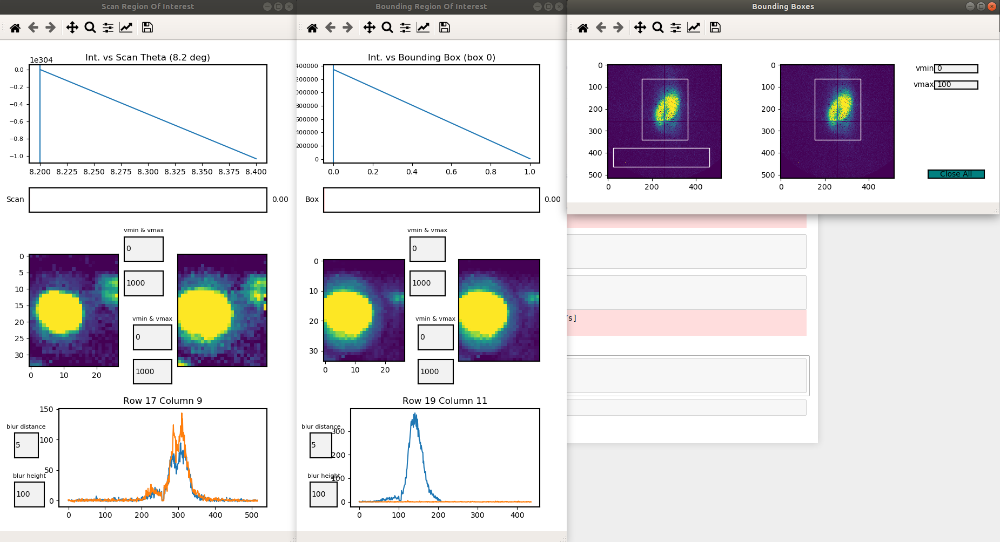
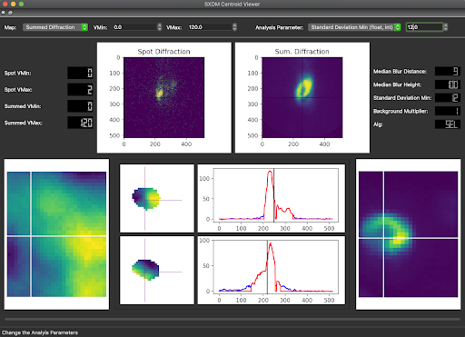

Visualization of Results
========================

Region of Interest Viewer
-------------------------

This will bring up the default Region Of Interest viewer, once the ``test_fs.roi_results`` have been calculated.

.. code:: python

    test_fs.roi_viewer()

.. warning:: Please use the `close all` box to close all windows. If not the program may keep cached data

.. note::

    Median Blur Height will be only be enabled for a `median_blur_algorithm='selective'`

.. note::

    User can move sliders as well as click on maps to show intensity values/scan values

Centroid Analysis Viewer
------------------------

This will bring up the default Region Of Interest viewer, once the ``test_fs.centroid_results`` have been calculated.

.. code:: python

    test_fs.centroid_viewer()

.. note::

    Median Blur Height will be only be enabled for a `median_blur_algorithm='selective'`

.. note::

    User can click on maps to display how the program is interpreting pixel data. 

Return Raw Centroid Map Values
------------------------------
Takes the test_fs.results and a User defined map_type and returns either the centroid data or the ROI data for the
``test_fs.resutls`` variable.

.. code:: python

    centroid_roi_map(results, map_type)

``results`` (nd.array) - the test_fs.results value

``map_type`` - acceptable values - full_roi, chi_centroid, ttheta_centroid

Make New Bound For Centroid Maps
--------------------------------

The centroid maps are in values associated with their centroid position of the .tif image dimensions (usually 516, 516).
To change what the bound/values are for the centroid values the user can set values for user_map and new_bounds to
rebound the centroid maps.

.. code:: python

    maps_correct(user_map, new_bounds)

``user_map`` - the output of the centroid_roi_map() function

``new_bounds`` - np.linspace(lowerbound, higherbound, dim of image)

Errors
------

The main visual error will be the Psyduck error. This occurs when the program cannot properly load
the corresponding data for a given plot. Psyduck is confused and so is everyone else.

.. figure:: images/psy.png
    :scale: 50 %
    :align: center

